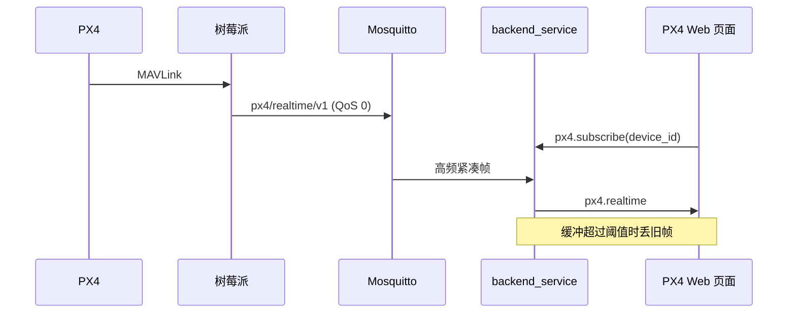

# PX4 专属 Web 低延迟链路部署

## 结论

本实现保留现有主控箱全部功能，并为真实 PX4 飞控增加独立控制台和独立实时通道。
新通道只转发到正在查看对应 PX4 的浏览器，不进入 PostgreSQL。

| 项目 | 主控箱 | PX4 真实飞控 |
| --- | --- | --- |
| 原设备列表、状态、数据库 | 保持不变 | 保持，作为慢照和回退 |
| 原 `device.state` WebSocket | 保持不变 | 保持 |
| 新高频 MQTT | 不发送 | 默认 20 Hz、QoS 0 |
| Web 页面 | 原控制台 | PX4 专属控制台 |
| 原主控箱私有命令 | 保持不变 | 明确隔离，不发送 |

## 数据路径



浏览器离开 PX4 页面后发送 `px4.unsubscribe` 并关闭专用 WebSocket。主控箱页面和设备
列表不会收到 PX4 高频帧。

## 上线顺序

为保证任一步失败都不影响现网，按以下顺序部署：

1. 先备份服务器当前配置和构建产物。
2. 部署 `backend_service` 和 `frontend`。
3. 验证设备列表、主控箱详情、主控箱命令仍正常。
4. 再部署树莓派 `cns_rpi`。
5. 打开真实 PX4 设备，页面应从“1 秒遥测回退”自动切换到“PX4 高频链路”。

服务器无需修改 MQTT 地址、PostgreSQL schema、Nginx `/ws` 配置或 `route_service`。

## 服务器构建与重启

```bash
npm ci
npm run typecheck
npm test
npm run build
```

部署时继续复用现有 systemd 服务和 Nginx 静态目录。重启后检查：

```bash
systemctl status cns-backend-service --no-pager
journalctl -u cns-backend-service -n 100 --no-pager
```

## 树莓派构建与重启

```bash
cmake -S . -B build
cmake --build build -j2
ctest --test-dir build --output-on-failure
sudo systemctl restart cns-rpi
journalctl -u cns-rpi -n 100 --no-pager
```

树莓派配置可显式加入：

```json
{
  "px4_realtime": {
    "enabled": true,
    "publish_interval_ms": 50
  }
}
```

旧配置不含该段也会对真实飞控默认启用；主控箱不会发送该 topic。

## 页面指标

- `端到端`：浏览器收到时间减树莓派 `sent_at`。
- `上行`：服务器收到时间减树莓派 `sent_at`。
- `Web 推送`：浏览器收到时间减服务器收到时间。
- `Hz`：浏览器最近约 2 秒实际接收频率。
- `丢弃帧`：根据 `sequence` 缺口累计。

端到端指标跨三台机器，必须保证时钟同步：

```bash
timedatectl status
```

Windows 地面站应开启“自动设置时间”和“立即同步”。

## 回滚

### 只关闭高频链路

树莓派设置：

```json
{
  "px4_realtime": {
    "enabled": false
  }
}
```

重启后 Web 自动使用原 1 Hz 慢照，其他功能不变。

### 回滚服务器版本

先关闭树莓派高频发布，再恢复上一版后端和前端。数据库没有新增表或迁移，无需回滚
数据。

## 延迟预期

应用自身新增等待由原来最多约 1000 ms 降为约 50 ms 发布周期，加上 5 ms 串口等待和
WebSocket 推送。最终端到端值仍由公网 5G RTT、抖动、FRP/MQTT 路径和三端负载决定，
不能仅靠软件保证始终低于 50 或 80 ms；弱网时本实现优先丢旧帧，避免延迟持续累积。
