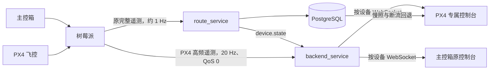

# 主控箱与 PX4 遥测入库策略

## 结论

主控箱和 PX4 的设备身份、在线状态及完整遥测慢照都进入现有 PostgreSQL。

PX4 另外增加一条 20 Hz 高频实时遥测通道。这条通道只服务正在打开的 PX4 Web
控制台，不写数据库。它不会替代原完整遥测，也不会改变主控箱现有数据路径。

| 数据 | 主控箱 | PX4 | 是否入库 | 默认频率 |
| --- | --- | --- | --- | --- |
| 设备注册、身份、在线状态 | 发送 | 发送 | 是 | 状态变化时 |
| 原完整遥测 `cns_rpi/{device_id}/telemetry` | 发送 | 发送 | 是 | 约 1 Hz |
| PX4 高频遥测 `cns_rpi/{device_id}/px4/realtime/v1` | 不发送 | 发送 | 否 | 20 Hz |

## 整体流程



主控箱只走原链路。PX4 同时走原链路和新增高频链路。

## 为什么高频帧不直接入库

20 Hz 表示每台 PX4 每天最多产生：

```text
20 × 60 × 60 × 24 = 1,728,000 帧
```

实时姿态页面只需要最新一帧。如果所有帧直接写入现有设备表，会带来：

- 高频数据库事务和磁盘写入；
- 数据库、服务器和 Web 之间的排队延迟；
- 弱网恢复后旧帧积压，页面显示过时姿态；
- 数据量快速膨胀，影响现有主控箱查询和运维。

因此高频链路采用 QoS 0、`retain=false` 和“只显示最新帧”。网络或浏览器处理不过来时，
允许丢弃旧帧，避免延迟持续累积。

## PX4 哪些数据仍然入库

PX4 原有约 1 Hz 完整遥测保持不变，因此下列信息继续由 `route_service` 持久化：

- PX4 设备 ID；
- Remote ID；
- 设备类型和 MAVLink 端点；
- 在线、离线和最后活跃时间；
- 最新完整遥测；
- 姿态、位置、电池等约 1 Hz 慢照；
- 现有设备模型中支持的身份和状态字段。

当高频通道断流超过 2 秒，PX4 Web 页面自动使用这份数据库慢照，不会变成空白页。

## 主控箱是否入库

主控箱继续使用：

```text
cns_rpi/{device_id}/telemetry
```

`route_service` 按原逻辑解析、更新设备状态并写入 PostgreSQL。主控箱没有新增 20 Hz
topic，原 Web 页面、数据库结构和控制命令均保持不变。

## 如果将来需要高频历史

不建议把 20 Hz 原始帧直接写入现有设备表。可新增独立的飞行时序存储策略，例如：

1. Web 实时显示保持 20 Hz；
2. 按 500 ms 或 1 s 降采样后保存轨迹；
3. 关键事件、告警和控制结果立即保存；
4. 完整高频飞行记录使用独立时序表、分区表或飞行日志文件；
5. 设置保存期限和自动归档，不影响现有设备查询。

这属于后续历史轨迹功能，不是本次低延迟实时链路的必要条件。

## 不影响现有功能的保证

- 未修改 PostgreSQL schema 和迁移文件；
- 未修改 `route_service`；
- 未修改原遥测 topic；
- 未修改主控箱控制协议；
- 高频 topic 只由真实 PX4 发布；
- 浏览器只有进入对应 PX4 页面后才订阅高频帧；
- 高频链路可在树莓派配置中独立关闭。
