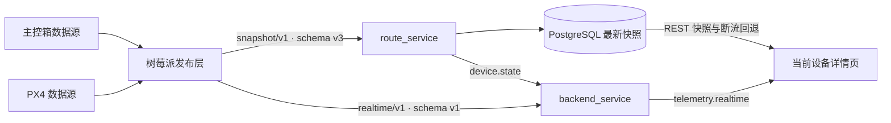

# 主控箱与 PX4 遥测入库策略

## 结论

主控箱和 PX4 使用相同的快照与实时遥测通道。发布层、MQTT 适配层和 WebSocket
传输层不关心遥测由谁产生，也不按 `device_type` 分流。

| 数据 | Topic | Schema | 是否入库 | 默认频率 |
| --- | --- | --- | --- | --- |
| 设备注册、身份、在线状态 | `cns_rpi/{device_id}/registration` | v3 | 是 | 状态变化时 |
| 完整遥测快照 | `cns_rpi/{device_id}/telemetry/snapshot/v1` | v3 | 是 | 约 1 Hz |
| 通用实时遥测 | `cns_rpi/{device_id}/telemetry/realtime/v1` | v1 | 否 | 约 10 Hz，最高 20 Hz |

旧 `cns_rpi/{device_id}/telemetry` 和
`cns_rpi/{device_id}/px4/realtime/v1` 不提供兼容入口，服务器直接拒绝。

## 数据路径

`route_service` 只通配订阅快照 Topic，沿用现有合并写库和规范化状态事件链路。
`backend_service` 不通配订阅实时帧；只有至少一个浏览器查看某设备时，才精确订阅该
`device_id` 的实时 Topic，最后一个页面离开后退订。

## 入库边界

完整快照保存设备身份、Remote ID、在线状态和当前完整遥测。默认约 1 Hz 的发布频率与
route_service 默认 5 秒合并写入节拍不冲突，同一设备在一个周期内只写最后一份。

实时帧采用 QoS 0、`retain=false`，只服务当前页面：

- 不写 PostgreSQL；
- 不建立历史表或数据库迁移；
- 弱网或消费者处理不过来时允许丢弃旧帧；
- 前端同一绘制周期只应用最后一帧；
- 连续 2 秒没有新帧时回退最新快照，不改变 registration 决定的在线状态。

## 开放遥测对象

实时帧外壳固定，`telemetry` 是开放 JSON 对象。它可以包含主控箱 `motor`、PX4
`attitude`、`gps`、`global_position`、`sys_status`、`battery`、`pressure`，也可以同时
包含这些字段。服务器只校验外壳、schema 和 Topic/Payload 的 `device_id` 一致性，不按
设备类型拒绝内部字段。

## 后续历史需求

如果将来需要轨迹或高频历史，应单独设计降采样、分区和保留期限，不把 10–20 Hz 原始帧
直接写入现有最新状态表。本次没有数据库结构变化，不需要数据库备份或迁移回滚。
