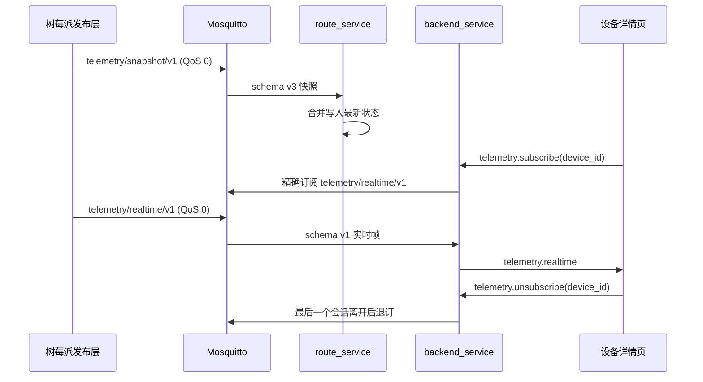

# 通用实时遥测 Web 链路部署

## 目标

服务器直接切换到 RPi 统一遥测 Topic：

```text
快照：cns_rpi/{device_id}/telemetry/snapshot/v1，schema v3，约 1 Hz
实时：cns_rpi/{device_id}/telemetry/realtime/v1，schema v1，约 10 Hz、最高 20 Hz
```

快照由 `route_service` 消费并入库；实时帧由 `backend_service` 根据浏览器页面兴趣精确订阅，
通过 `telemetry.realtime` 转发，不入库。主控箱和 PX4 共用同一传输链路，没有 PX4 专属
Topic、REST 接口、WebSocket 事件或 RTT 探测。

## 数据路径



## 上线顺序

RPi 已按新协议实施，因此服务器按以下顺序切换：

1. 部署并重启 `route_service`，确认只订阅 `cns_rpi/+/telemetry/snapshot/v1`；
2. 部署 `backend_service` 和前端，确认无页面时没有实时 Topic 订阅；
3. 重启或恢复 RPi 发布，确认快照入库和当前页面实时显示；
4. 分别打开主控箱与 PX4 页面，确认都使用同一个实时 Topic 和 WebSocket 事件；
5. 停止实时发布 2 秒，确认页面回退快照且设备在线状态不变。

旧 schema 和旧 Topic 直接拒绝，不做双发、兼容或回滚别名。本次没有数据库 schema 变化，
不执行数据库备份或 migration。

## 构建验证

```bash
cmake -S route_service -B route_service/build -DCMAKE_BUILD_TYPE=Debug
cmake --build route_service/build -j2
ctest --test-dir route_service/build --output-on-failure

npm ci
npm run typecheck
npm test
npm run build
```

继续复用现有 PostgreSQL、Mosquitto、systemd 和 Nginx 配置。代码部署完成后重启：

```bash
sudo systemctl restart cns-route-service
sudo systemctl restart cns-backend-service
sudo systemctl status cns-route-service cns-backend-service --no-pager
journalctl -u cns-route-service -u cns-backend-service -n 150 --no-pager
```

前端按现场既有方式发布到 Nginx 静态目录，不修改 `/api/` 和 `/ws` 代理。

## 验收

- Route Service 存在快照通配订阅，不存在旧 `+/telemetry` 订阅；
- 无详情页时 Backend 没有实时订阅；
- 打开一个设备页面时只出现该设备的精确实时订阅；
- 多页面查看同一设备不重复订阅，最后一页关闭后退订；
- 主控箱 `motor` 与 PX4 飞行字段都能刷新；
- 浏览器处理不过来时丢弃旧帧，不形成延迟队列；
- 连续 2 秒无实时帧后显示快照回退；
- Broker、Backend 和浏览器均没有 PX4 RTT 探测或 ACK；
- PostgreSQL 只随快照链路更新，实时帧不入库。

## 回退边界

服务器版本如需回退，应同时停止新协议 RPi 发布或切换到配套版本，不能依赖旧 Topic 兼容。
数据库没有新增表或迁移，无数据回滚步骤。
