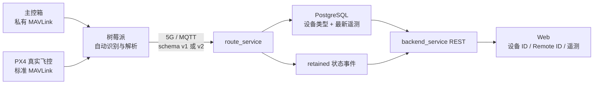

# PX4 真实飞控与 schema v2 接入

## 目标

同一套服务端同时接收：

- CNS 主控箱：兼容原有 MQTT schema v1，也接受树莓派统一 schema v2。
- PX4 真实飞控：接受树莓派解析 MAVLink 后发布的 schema v2，保存设备 ID、Remote ID 和完整遥测。

一台树莓派只连接一台主控箱或一台真实飞控。服务端不解析 MAVLink 二进制帧，只解析树莓派发布的 JSON。



## MQTT 输入

Topic 仍为：

```text
{namespace}/{device_id}/registration
{namespace}/{device_id}/telemetry
```

`device_id` 长度为 1～64，只允许 `A-Z a-z 0-9 . _ : -`。主控箱继续使用原 20 位厂商编号；PX4 优先使用 `PX4U2-<36HEX>`，否则使用 `PX4U1-<16HEX>`。

### schema v1

旧主控箱报文保持兼容，缺省设备类型为 `cns_box`。原来的 `vendor_id`、`school_name` 和 `dcdw_label` 规则不变。

### schema v2

注册和遥测都必须包含：

```json
{
  "schema_version": 2,
  "device_id": "PX4U2-00112233445566778899AABBCCDDEEFF0011",
  "device_type": "flight_controller"
}
```

允许的 `device_type`：

- `cns_box`
- `flight_controller`

Topic 中的设备 ID 必须与消息体 `device_id` 完全一致。PX4 注册允许暂不绑定学校；主控箱 online 注册仍要求学校。`identity.remote_id`、`identity.uid`、`identity.uid2` 以及未知遥测字段均原样保存在最新 JSONB 快照中。

## 数据库与对外接口

迁移 `005_增加通用设备类型与扩展标识.sql`：

- 将设备相关标识扩展到 `VARCHAR(64)`。
- 为 `devices` 增加 `device_type`。
- 允许 PX4 的 `school_id` 暂为空。
- 保留原 `vendor_id` 列名，避免破坏现有外键和命令协议。

REST、WebSocket 和 route_service 状态事件同时输出：

- `device_id`：统一设备标识。
- `device_type`：设备类型。
- `vendor_id`：兼容旧客户端的同值别名。

Web 对 PX4 显示设备 ID、Remote ID 和完整遥测；主控箱页面保留角色号、双电源、自检和私有控制能力。PX4 的主控箱私有 control 命令在 backend_service 与 route_service 两层均拒绝，错误码为 `unsupported_device_type`；树莓派运行时配置仍可下发。

## 部署顺序

1. 备份 PostgreSQL。
2. 停止旧 route_service 和 backend_service。
3. 构建新版本。
4. 使用 route_service `--migrate-only` 显式执行迁移 005。
5. 启动 route_service、backend_service 和前端。
6. 先验证旧主控箱，再接入 PX4，确认数据库、REST、WebSocket 和页面中的设备类型、设备 ID、Remote ID 与遥测一致。

本次没有在现场服务器执行迁移或部署；真实 PostgreSQL/MQTT 链路仍需按以上顺序验收。
